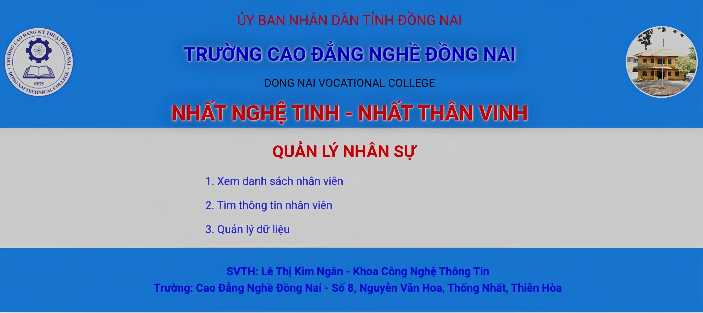

# 🌟 Employee Management System - QLNhanVien 🌟

Welcome to the **Employee Management System (QLNhanVien)**, a comprehensive web application built with **PHP** and **CSS** to manage employee information, including details, attendance, and performance. This project aims to streamline HR processes and improve efficiency.

---

## 📸 Screenshots


*Screenshot of the employee management interface showcasing key functionalities.*

---

## 🧩 Features

- **Employee Records**: Add, edit, and delete employee information.
- **Attendance Tracking**: Monitor attendance and generate reports.
- **Performance Evaluation**: Evaluate employee performance with customizable metrics.
- **Responsive Design**: Ensures usability across various devices.

---

## 🚀 Getting Started

To get started with this project, follow the steps below:

### Prerequisites

- **PHP** installed on your server.
- Basic knowledge of **CSS** and **HTML** for customization (if needed).

### Installation

1. Clone the repository:
   ```bash
   git clone https://github.com/Heliophile0208/quanlynhanvien
